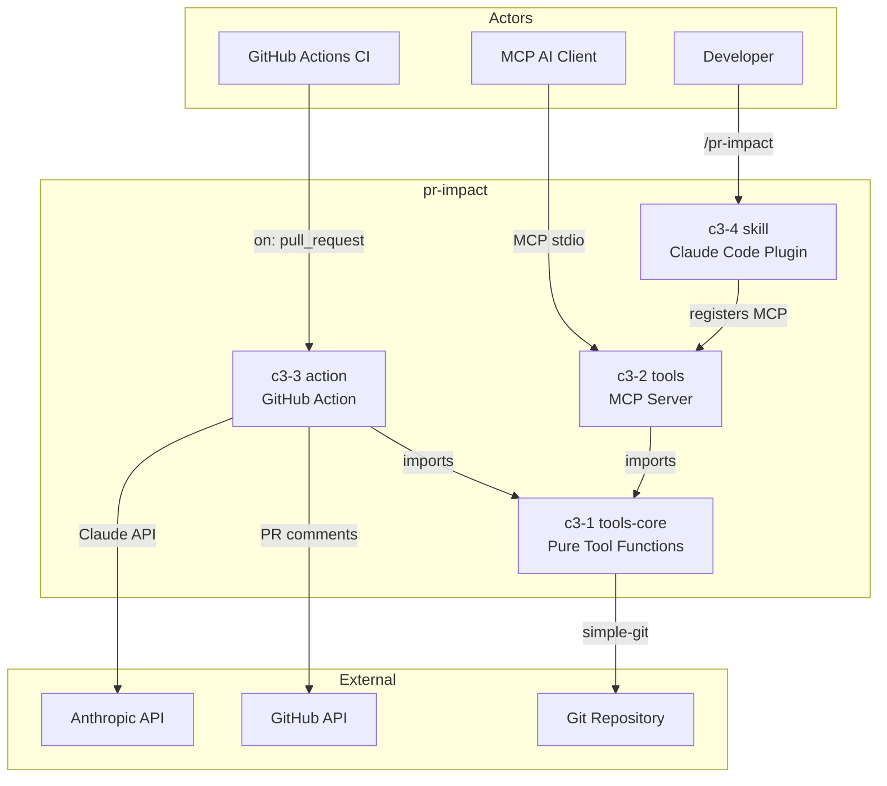

# pr-impact

## Goal

AI-powered PR impact analysis — detect breaking changes, map blast radius, and score risk before merge.

## Overview

## Abstract Constraints

| Constraint | Rationale | Affected Containers |
|------------|-----------|---------------------|
| All git operations via simple-git | Testability and safety — no raw child_process | c3-1 |
| Templates are single source of truth | Prevent prompt/report drift between action and skill | c3-3, c3-4 |
| Tool definitions must be canonical and shared | Prevent tool schema drift between MCP server and action | c3-1, c3-2, c3-3 |
| ESM-only, CJS exception for action | GitHub Actions requires CommonJS entry point | All |
| Agentic loop safety limits (30 iters, 180s) | Prevent runaway API costs | c3-3 |

## Containers

| ID | Name | Boundary | Status | Responsibilities | Goal Contribution |
|----|------|----------|--------|------------------|-------------------|
| c3-1 | tools-core | library | implemented | Pure git/repo tool functions; canonical tool definitions | Shared foundation — all analysis evidence gathering |
| c3-2 | tools | service | implemented | MCP protocol server wrapping tools-core | Exposes tools to any MCP-compatible AI client |
| c3-3 | action | worker | implemented | Agentic Claude loop, tool dispatch, PR comment posting | Automated CI analysis with threshold gating |
| c3-4 | skill | app | implemented | Claude Code plugin config, assembled skill prompt | Interactive developer analysis via /pr-impact |
