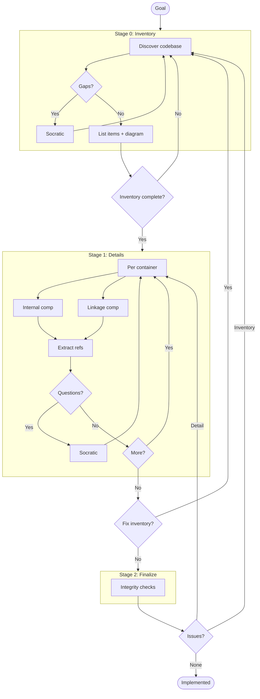
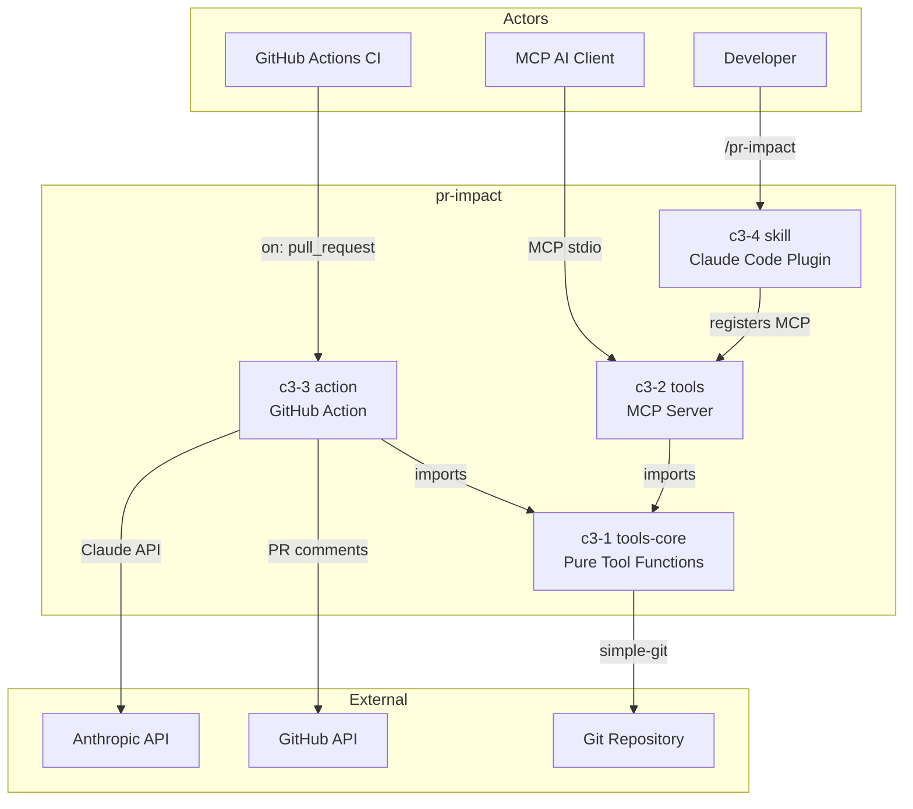

# C3 Architecture Documentation Adoption

## Goal

Adopt C3 methodology for pr-impact.

<!--
EXIT CRITERIA (all must be true to mark implemented):
- All containers documented with Goal Contribution
- All components documented with Container Connection
- Refs extracted for repeated patterns
- Integrity checks pass
- Audit passes
-->

## Workflow

---

## Stage 0: Inventory

### Context Discovery

| Arg | Value |
|-----|-------|
| PROJECT | pr-impact |
| GOAL | AI-powered PR impact analysis — detect breaking changes, map blast radius, and score risk before merge |
| SUMMARY | TypeScript monorepo providing Claude-driven PR analysis via GitHub Action, Claude Code plugin, and MCP tools |

### Abstract Constraints

| Constraint | Rationale | Affected Containers |
|------------|-----------|---------------------|
| All git operations must go through simple-git | Avoid raw child_process for testability and safety | c3-1-tools-core |
| Templates are the single source of truth for analysis methodology | Prevent prompt/report drift between action and skill | c3-3-action, c3-4-skill |
| Tool definitions must be canonical and shared | Prevent tool schema drift between MCP server and action | c3-1-tools-core, c3-2-tools, c3-3-action |
| ESM-only with CJS exception for action output | GitHub Actions requires CommonJS entry point | c3-1-tools-core, c3-2-tools, c3-3-action |
| Agentic loop has safety limits (30 iterations, 180s timeout) | Prevent runaway API costs and unbounded execution | c3-3-action |

### Container Discovery

| N | CONTAINER_NAME | BOUNDARY | GOAL | SUMMARY |
|---|----------------|----------|------|---------|
| 1 | tools-core | library | Provide pure git/repo tool functions with no framework dependency | 6 handler functions + shared tool definitions; the shared foundation both tools and action import |
| 2 | tools | service | Expose tools-core as MCP protocol tools for AI clients | Thin MCP server wrapping tools-core with zod schemas via stdio transport |
| 3 | action | worker | Run agentic Claude analysis loop in CI and post PR comments | GitHub Action that calls Anthropic API, dispatches tool calls to tools-core, posts reports |
| 4 | skill | app | Provide the /pr-impact slash command for interactive Claude Code analysis | Claude Code plugin assembled from shared templates; no runtime deps |

### Component Discovery (Brief)

| N | NN | COMPONENT_NAME | CATEGORY | GOAL | SUMMARY |
|---|----|--------------  |----------|------|---------|
| 1 | 01 | tool-definitions | foundation | Canonical tool schemas shared by MCP server and action | TOOL_DEFS array with name, description, properties, required fields |
| 1 | 10 | git-diff | feature | Get raw git diff between two refs | Wraps simple-git diff with optional per-file filtering |
| 1 | 11 | read-file | feature | Read file content at a specific git ref | Wraps simple-git show for ref:path lookups |
| 1 | 12 | list-files | feature | List changed files with status and line stats | Combines --name-status with diffSummary for full file info |
| 1 | 13 | search-code | feature | Search for regex patterns via git grep | Uses git.raw() for reliable glob filtering; handles exit code 1 |
| 1 | 14 | find-importers | feature | Build cached reverse dependency map and find importers | Scans all source files with fast-glob; session-level cache |
| 1 | 15 | list-tests | feature | Find test files associated with source files | Generates candidate paths across sibling/__tests__/test/ dirs |
| 2 | 01 | mcp-server | foundation | MCP stdio transport with lifecycle management | Creates McpServer, connects StdioServerTransport, handles SIGINT/SIGTERM |
| 2 | 10 | tool-registration | feature | Convert tool-defs to zod schemas and register on MCP server | defToZod() + registerAllTools() wrapping each tools-core handler |
| 3 | 01 | template-embedding | foundation | Build-time template generation for runtime access | scripts/embed-templates.ts generates src/generated/templates.ts |
| 3 | 10 | agentic-client | feature | Anthropic API agentic loop with safety limits | 30-iteration max, 180s timeout, temperature 0, parallel tool execution |
| 3 | 11 | tool-dispatcher | feature | Route tool_use calls to tools-core functions | Switch-based dispatch with repoPath injection |
| 3 | 12 | comment-poster | feature | Upsert PR comments via GitHub API with HTML markers | Paginated search for existing marker, PATCH or POST |
| 3 | 13 | action-entrypoint | feature | Read inputs, run analysis, parse score, gate threshold | Orchestrates analysis flow, sets outputs, applies threshold |
| 4 | 01 | plugin-config | foundation | Claude Code plugin metadata and MCP server registration | .claude-plugin/config.json + mcp.json |
| 4 | 10 | skill-prompt | feature | Assembled analysis prompt from shared templates | skill.md generated by scripts/build-skill.ts |

### Ref Discovery

| SLUG | TITLE | GOAL | Scope | Applies To |
|------|-------|------|-------|------------|
| build-pipeline | Build Pipeline & Template Embedding | Ensure templates are single source of truth consumed at build time | Build-time | c3-3-action, c3-4-skill |
| esm-conventions | ESM Module Conventions | Enforce ESM-only with .js extensions and CJS exception for action | All packages | c3-1-tools-core, c3-2-tools, c3-3-action, c3-4-skill |
| git-operations | Git Operation Patterns | Standardize all git access through simple-git | Runtime git calls | c3-1-tools-core |

### Overview Diagram

### Gate 0

- [x] Context args filled (PROJECT, GOAL, SUMMARY)
- [x] Abstract Constraints identified
- [x] All containers identified with args (including BOUNDARY)
- [x] All components identified (brief) with args and category
- [x] Cross-cutting refs identified
- [x] Overview diagram generated

---

## Stage 1: Details

### Container: c3-1-tools-core

**Created:** [x] `.c3/c3-1-tools-core/README.md`

| Type | Component ID | Name | Category | Doc Created |
|------|--------------|------|----------|-------------|
| Internal | c3-101 | tool-definitions | foundation | [x] |
| Internal | c3-110 | git-diff | feature | [x] |
| Internal | c3-111 | read-file | feature | [x] |
| Internal | c3-112 | list-files | feature | [x] |
| Internal | c3-113 | search-code | feature | [x] |
| Internal | c3-114 | find-importers | feature | [x] |
| Internal | c3-115 | list-tests | feature | [x] |

### Container: c3-2-tools

**Created:** [x] `.c3/c3-2-tools/README.md`

| Type | Component ID | Name | Category | Doc Created |
|------|--------------|------|----------|-------------|
| Internal | c3-201 | mcp-server | foundation | [x] |
| Linkage | c3-210 | tool-registration | feature | [x] |

### Container: c3-3-action

**Created:** [x] `.c3/c3-3-action/README.md`

| Type | Component ID | Name | Category | Doc Created |
|------|--------------|------|----------|-------------|
| Internal | c3-301 | template-embedding | foundation | [x] |
| Internal | c3-310 | agentic-client | feature | [x] |
| Linkage | c3-311 | tool-dispatcher | feature | [x] |
| Internal | c3-312 | comment-poster | feature | [x] |
| Internal | c3-313 | action-entrypoint | feature | [x] |

### Container: c3-4-skill

**Created:** [x] `.c3/c3-4-skill/README.md`

| Type | Component ID | Name | Category | Doc Created |
|------|--------------|------|----------|-------------|
| Internal | c3-401 | plugin-config | foundation | [x] |
| Internal | c3-410 | skill-prompt | feature | [x] |

### Refs Created

| Ref ID | Pattern | Doc Created |
|--------|---------|-------------|
| ref-build-pipeline | Build Pipeline & Template Embedding | [x] |
| ref-esm-conventions | ESM Module Conventions | [x] |
| ref-git-operations | Git Operation Patterns | [x] |

### Gate 1

- [x] All container README.md created
- [x] All component docs created
- [x] All refs documented
- [x] No new items discovered

---

## Stage 2: Finalize

### Integrity Checks

| Check | Status |
|-------|--------|
| Context <-> Container (all containers listed in c3-0) | [x] |
| Container <-> Component (all components listed in container README) | [x] |
| Component <-> Component (linkages documented) | [x] |
| * <-> Refs (refs cited correctly, Cited By updated) | [x] |

### Gate 2

- [x] All integrity checks pass
- [x] Run audit (9 PASS, 1 WARN expected on fresh onboard)

---

## Conflict Resolution

If later stage reveals earlier errors:

| Conflict | Found In | Affects | Resolution |
|----------|----------|---------|------------|
| | | | |

---

## Exit

When Gate 2 complete -> change frontmatter status to `implemented`

## Audit Record

| Phase | Date | Notes |
|-------|------|-------|
| Adopted | 2026-02-12 | Initial C3 structure created |
| Implemented | 2026-02-12 | All gates passed, audit clean (9 PASS, 1 expected WARN) |
