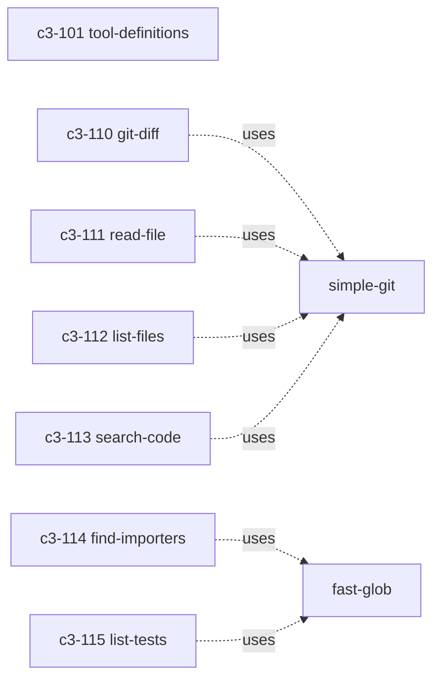

# tools-core

## Goal

Provide pure git/repo tool functions with no framework dependency. Both the MCP server (c3-2) and GitHub Action (c3-3) import from here, eliminating duplication.

## Responsibilities

- Own all git/filesystem interaction logic (simple-git, fast-glob)
- Define canonical tool schemas (TOOL_DEFS) consumed by MCP and action
- Export typed handler functions with consistent `repoPath` parameter pattern
- Cache expensive operations (reverse dependency map) at session level

## Complexity Assessment

**Level:** moderate
**Why:** Multiple independent tools with different git/fs operations; session-level caching in find-importers; regex-based import parsing with 3 patterns; file status mapping from git output format; candidate path generation across multiple directory conventions.

## Components

| ID | Name | Category | Status | Goal Contribution |
|----|------|----------|--------|-------------------|
| c3-101 | tool-definitions | foundation | implemented | Canonical schemas shared across consumers |
| c3-110 | git-diff | feature | implemented | Raw diff evidence for breaking change detection |
| c3-111 | read-file | feature | implemented | File content at any ref for before/after comparison |
| c3-112 | list-files | feature | implemented | Changed file inventory with status and stats |
| c3-113 | search-code | feature | implemented | Pattern search for doc staleness and symbol references |
| c3-114 | find-importers | feature | implemented | Reverse dependency map for impact graph |
| c3-115 | list-tests | feature | implemented | Test file discovery for coverage gap analysis |

## Internal Dependencies

All 6 tool handlers are independent of each other. TOOL_DEFS (c3-101) is a pure data structure with no code dependencies.
