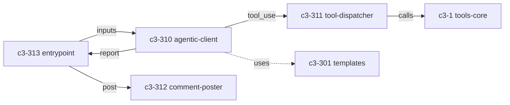

# action

## Goal

Run agentic Claude analysis loop in CI and post PR comments. Orchestrates the full analysis pipeline: read inputs, call Claude with tools, gather evidence, produce report, post comment, gate on threshold.

## Responsibilities

- Embed prompt/report templates at build time (no runtime filesystem reads)
- Drive the Anthropic API agentic loop within safety limits
- Dispatch tool_use calls to tools-core functions with repoPath injection
- Parse risk score from generated report
- Post/update PR comment via GitHub API with idempotent markers
- Fail CI if risk score exceeds threshold

## Complexity Assessment

**Level:** moderate
**Why:** Agentic loop with multiple stop conditions (iteration limit, wall-clock timeout, end_turn); parallel tool execution via Promise.all; risk score regex parsing with graceful fallback; comment upsert with pagination; CJS bundling with all dependencies inlined.

## Components

| ID | Name | Category | Status | Goal Contribution |
|----|------|----------|--------|-------------------|
| c3-301 | template-embedding | foundation | implemented | Build-time template access without filesystem reads |
| c3-310 | agentic-client | feature | implemented | Claude API loop producing the analysis report |
| c3-311 | tool-dispatcher | feature | implemented | Routes tool_use to tools-core with repoPath injection |
| c3-312 | comment-poster | feature | implemented | Idempotent PR comment upsert via GitHub API |
| c3-313 | action-entrypoint | feature | implemented | Orchestrates inputs → analysis → outputs → gating |

## Internal Flow

