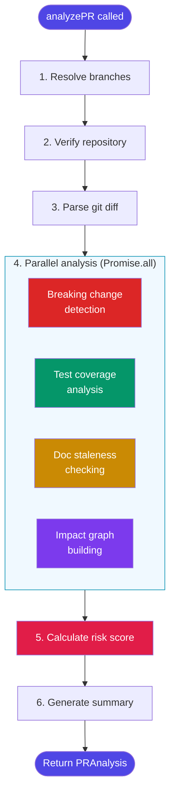
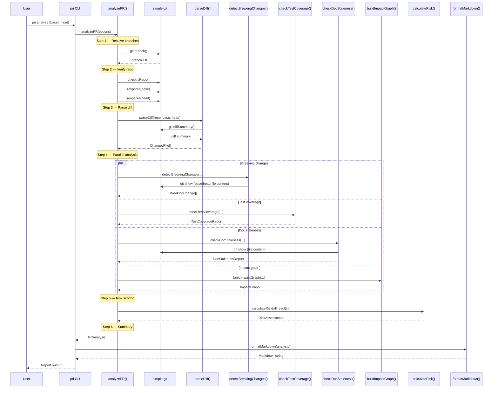
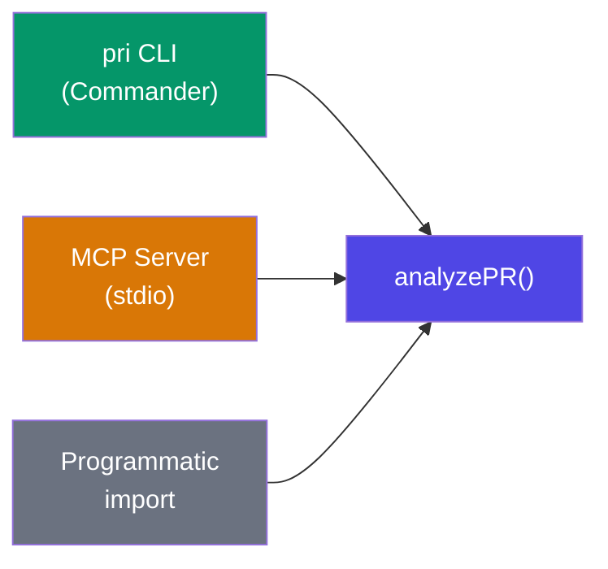

# Analysis Pipeline

The `analyzePR()` function in `packages/core/src/analyzer.ts` is the top-level orchestrator. It runs a six-step pipeline that produces a complete `PRAnalysis` result.

---

## Pipeline Overview

---

## Step-by-Step Breakdown

### Step 1 -- Resolve Branches

The base branch defaults to `main` or `master` (auto-detected from local branches). The head branch defaults to `HEAD`. Both can be overridden via `AnalysisOptions`.

### Step 2 -- Verify Repository

Uses `simple-git` to confirm:
- The path is a valid git repository (`git.checkIsRepo()`)
- The base branch ref is valid (`git.revparse([baseBranch])`)
- The head branch ref is valid (`git.revparse([headBranch])`)

### Step 3 -- Parse Diff

`parseDiff()` calls `git.diffSummary()` (via simple-git) between base and head, then categorizes each changed file (source, test, doc, config, other).

### Step 4 -- Parallel Analysis

Four independent analyses run concurrently. Each can be individually skipped via options (`skipBreaking`, `skipCoverage`, `skipDocs`):

| Analysis | Function | Skippable | What it produces |
|---|---|---|---|
| Breaking changes | `detectBreakingChanges()` | Yes | `BreakingChange[]` |
| Test coverage | `checkTestCoverage()` | Yes | `TestCoverageReport` |
| Doc staleness | `checkDocStaleness()` | Yes | `DocStalenessReport` |
| Impact graph | `buildImpactGraph()` | No | `ImpactGraph` |

### Step 5 -- Calculate Risk

`calculateRisk()` evaluates six weighted factors from the combined results and produces a 0-100 score with a severity level.

### Step 6 -- Generate Summary

A human-readable summary string is built from the results (file count, additions/deletions, risk level, breaking change count, coverage gaps).

---

## Sequence Diagram

---

## Skip Behavior

When an analysis step is skipped, `analyzePR()` returns a neutral default:

| Step | Default when skipped |
|---|---|
| Breaking changes | Empty array `[]` |
| Test coverage | `{ changedSourceFiles: 0, sourceFilesWithTestChanges: 0, coverageRatio: 0, gaps: [] }` |
| Doc staleness | `{ staleReferences: [], checkedFiles: [] }` |

The impact graph is always built (not skippable) because it feeds into the risk score and provides the blast radius view.

---

## Entry Points

The pipeline is invoked from three surfaces:

- **CLI** -- `pri analyze` command calls `analyzePR()` then formats output.
- **MCP Server** -- `analyze_diff` tool calls `analyzePR()` and returns a Markdown-formatted report.
- **Programmatic API** -- direct import from `@pr-impact/core`.
