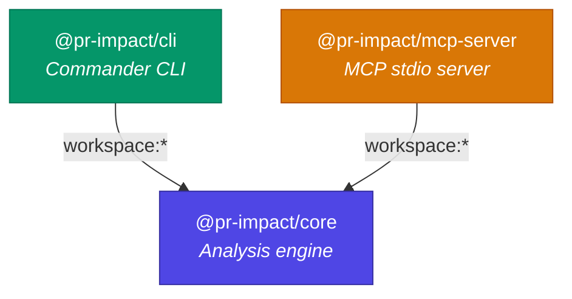
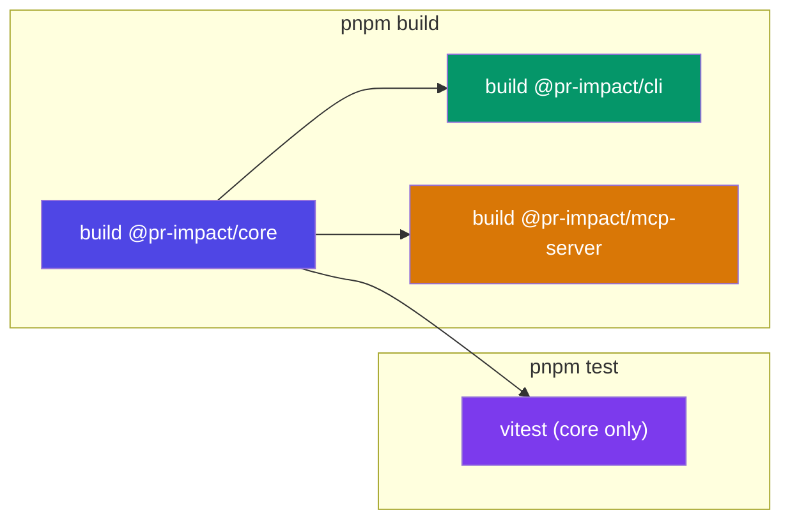
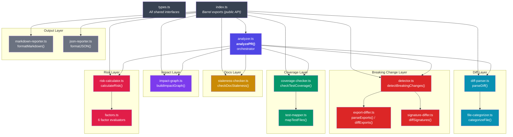

# Architecture

pr-impact is a TypeScript monorepo that performs static analysis on pull requests. It is managed with **pnpm** workspaces and **Turborepo**.

---

## Monorepo Layout

```
pr-impact/
├── packages/
│   ├── core/           @pr-impact/core
│   ├── cli/            @pr-impact/cli
│   └── mcp-server/     @pr-impact/mcp-server
├── turbo.json
├── pnpm-workspace.yaml
└── package.json
```

## Package Dependency Graph



Both `cli` and `mcp-server` depend on `core` via pnpm `workspace:*` links. The `core` package has zero internal workspace dependencies.

---

## Build Pipeline (Turborepo)



- `build` depends on `^build` (dependency packages build first).
- `test` depends on `build` completing.
- All packages use **tsup** for bundling (ESM format, sourcemaps). The `core` package also generates TypeScript declarations (`dts: true`).

---

## Core Package Module Organization



---

## Key External Dependencies

| Package | Dependency | Purpose |
|---|---|---|
| `core` | `simple-git` | Git operations (diff, rev-parse, show, branch) |
| `core` | `fast-glob` | File discovery for test mapping and import scanning |
| `cli` | `commander` | CLI argument parsing and subcommands |
| `cli` | `chalk` | Terminal color output |
| `cli` | `ora` | Spinner for long-running operations |
| `mcp-server` | `@modelcontextprotocol/sdk` | MCP protocol server implementation |
| `mcp-server` | `zod` | Input schema validation for MCP tools |

---

## Design Principles

- **ESM only** -- all packages use `"type": "module"` with `.js` extensions in import paths.
- **Strict TypeScript** -- `tsconfig.base.json` sets `"strict": true`, target ES2022.
- **Barrel exports** -- the public API is defined in `packages/core/src/index.ts`.
- **Regex-based parsing** -- export and import detection use regex, not AST parsing.
- **Parallel analysis** -- `analyzePR()` runs 4 analysis steps concurrently via `Promise.all`.
- **No I/O in core** except git operations through `simple-git` and file reads through `fast-glob` / `fs/promises`.
