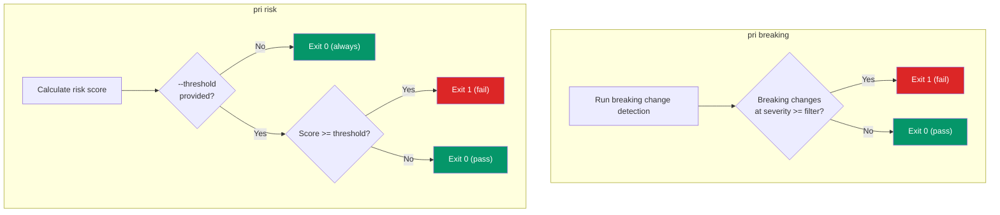
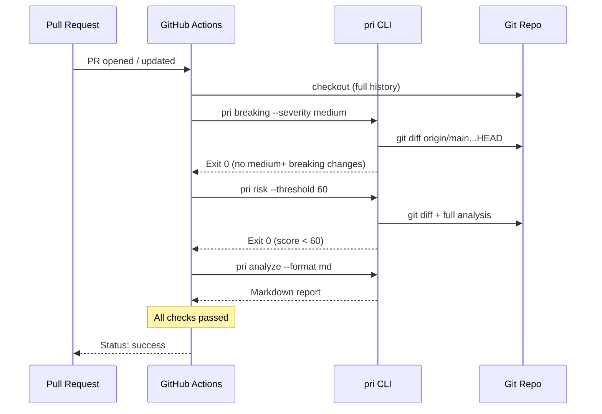

# CI Integration

pr-impact is designed to work as a quality gate in CI pipelines. The `pri breaking` and `pri risk` commands exit with code 1 when thresholds are exceeded, making them suitable for automated pass/fail checks.

---

## Exit Code Behavior



| Command | Condition for exit 1 | Flag |
|---|---|---|
| `pri breaking` | Any breaking change at or above the specified severity | `--severity <low\|medium\|high>` |
| `pri risk` | Risk score >= the specified threshold (requires `--threshold`) | `--threshold <n>` (optional, no default -- without it the command always exits 0) |

---

## GitHub Actions Example

```yaml
name: PR Impact Analysis

on:
  pull_request:
    branches: [main]

jobs:
  pr-impact:
    runs-on: ubuntu-latest
    steps:
      - uses: actions/checkout@v4
        with:
          fetch-depth: 0  # Full history needed for diff

      - uses: actions/setup-node@v4
        with:
          node-version: 20

      - name: Install pr-impact CLI
        run: npm install -g @pr-impact/cli

      - name: Check for breaking changes
        run: pri breaking origin/main HEAD --severity medium

      - name: Check risk score
        run: pri risk origin/main HEAD --threshold 60

      - name: Full analysis report
        if: always()
        run: pri analyze origin/main HEAD --format md
```

---

## CI Workflow Diagram



---

## Recommended Thresholds

| Gate | Recommended Setting | Rationale |
|---|---|---|
| Breaking changes | `--severity medium` | Blocks medium and high severity; allows low (renames) |
| Risk score | `--threshold 60` | Blocks high and critical risk PRs; allows low and medium |

Adjust these based on your team's tolerance. A stricter setup:

```bash
# Block any breaking change at all
pri breaking --severity low

# Block anything above low risk
pri risk --threshold 26
```

---

## Output Formats for CI

| Command | Format flag | Use case |
|---|---|---|
| `pri analyze --format md` | Markdown | Post as PR comment |
| `pri analyze --format json` | JSON | Parse in downstream scripts |
| `pri risk --format json` | JSON | Machine-readable score for dashboards |
| `pri impact --format dot` | Graphviz DOT | Generate SVG impact diagrams |

### Posting Reports as PR Comments

```yaml
      - name: Generate report
        run: pri analyze origin/main HEAD --format md --output report.md

      - name: Comment on PR
        uses: marocchino/sticky-pull-request-comment@v2
        with:
          path: report.md
```

---

## Important Notes

- **Fetch depth** -- always use `fetch-depth: 0` (full clone) so `git diff` can access the base branch history.
- **Branch references** -- in CI, use `origin/main` as the base (not just `main`) since the local branch may not exist.
- **Exit codes** -- `pri analyze` exits 0 on success (exits 1 only on internal error, not as a quality gate). Only `pri breaking` and `pri risk` can exit 1 based on analysis results.
- **`pri impact` differences** -- unlike other commands, `pri impact` takes an optional `[file]` positional argument (not `[base] [head]`), plus `--depth <n>` (default 3) and `--format <text|json|dot>`. It auto-detects `main`/`master` internally.
