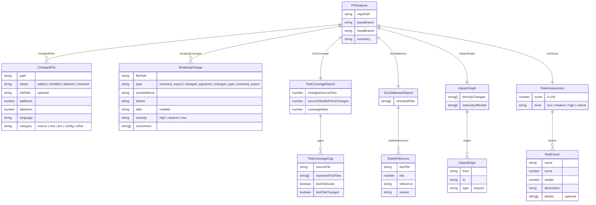

# Data Flow

All shared types are defined in `packages/core/src/types.ts` and re-exported from the barrel `index.ts`. This document maps how data flows between modules and the relationships between interfaces.

---

## Type Relationship Diagram



---

## Data Flow Through the Pipeline

```mermaid
flowchart LR
    subgraph Input
        OPT["AnalysisOptions<br/>repoPath, base, head,<br/>skipBreaking?, skipCoverage?, skipDocs?"]
    end

    subgraph "Step 3"
        DIFF["parseDiff()"]
    end

    subgraph "Step 4 — Parallel"
        BC["detectBreakingChanges()"]
        TC["checkTestCoverage()"]
        DS["checkDocStaleness()"]
        IG["buildImpactGraph()"]
    end

    subgraph "Step 5"
        RISK["calculateRisk()"]
    end

    subgraph Output
        PR["PRAnalysis"]
    end

    OPT -->|repoPath, base, head| DIFF
    DIFF -->|ChangedFile[]| BC
    DIFF -->|ChangedFile[]| TC
    DIFF -->|ChangedFile[]| DS
    DIFF -->|ChangedFile[]| IG
    BC -->|BreakingChange[]| RISK
    TC -->|TestCoverageReport| RISK
    DS -->|DocStalenessReport| RISK
    IG -->|ImpactGraph| RISK
    DIFF -->|ChangedFile[]| RISK
    RISK -->|RiskAssessment| PR
    BC -->|BreakingChange[]| PR
    TC -->|TestCoverageReport| PR
    DS -->|DocStalenessReport| PR
    IG -->|ImpactGraph| PR
    DIFF -->|ChangedFile[]| PR

    style OPT fill:#6b7280,color:#fff
    style DIFF fill:#0891b2,color:#fff
    style BC fill:#dc2626,color:#fff
    style TC fill:#059669,color:#fff
    style DS fill:#ca8a04,color:#fff
    style IG fill:#7c3aed,color:#fff
    style RISK fill:#e11d48,color:#fff
    style PR fill:#4f46e5,color:#fff
```

---

## Internal Types (Not Exported as Public API)

These types are used within the core package but not exposed to consumers:


- `ExportedSymbol` and `FileExports` are used by `export-differ.ts` and `detector.ts` for comparing exports between base and head branches.
- Although re-exported from `index.ts`, they are primarily internal to the breaking change detection layer.

---

## Module-to-Type Mapping

| Module | Consumes | Produces |
|---|---|---|
| `diff-parser.ts` | `repoPath`, `base`, `head` (strings) | `ChangedFile[]` |
| `file-categorizer.ts` | file path string | `category` field value |
| `detector.ts` | `ChangedFile[]`, git refs | `BreakingChange[]` |
| `export-differ.ts` | file content strings | `FileExports` (via `parseExports`), `{ removed, added, modified }` (via `diffExports`) |
| `signature-differ.ts` | signature strings | `{ changed, details }` |
| `import-resolver.ts` | `repoPath`, target file paths | `Map<string, string[]>` (consumers map) |
| `coverage-checker.ts` | `ChangedFile[]` | `TestCoverageReport` |
| `test-mapper.ts` | source file path | expected test file paths |
| `staleness-checker.ts` | `ChangedFile[]`, git refs | `DocStalenessReport` |
| `impact-graph.ts` | `ChangedFile[]` | `ImpactGraph` |
| `risk-calculator.ts` | all analysis results | `RiskAssessment` |
| `factors.ts` | individual analysis results | `RiskFactor` |
| `markdown-reporter.ts` | `PRAnalysis` | Markdown string |
| `json-reporter.ts` | `PRAnalysis` | JSON string |
