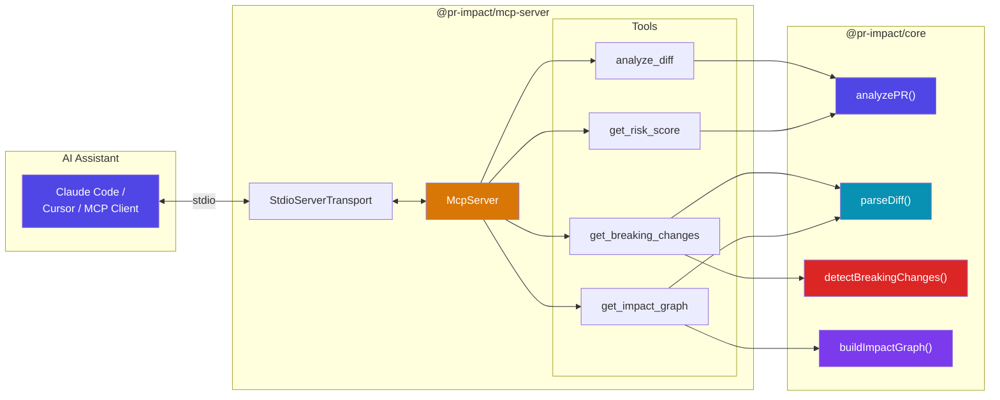
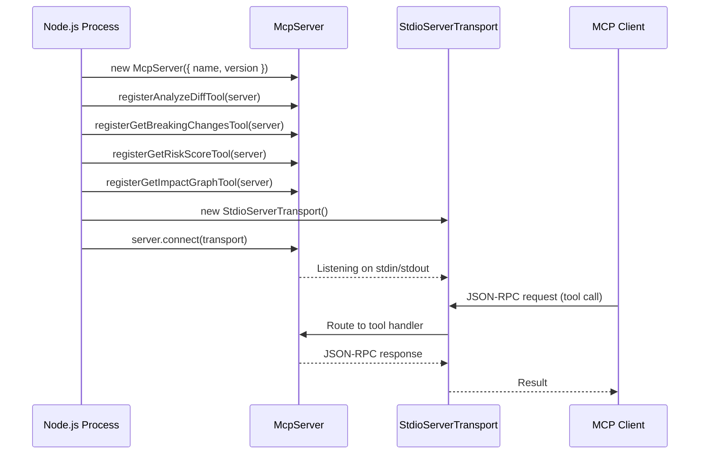
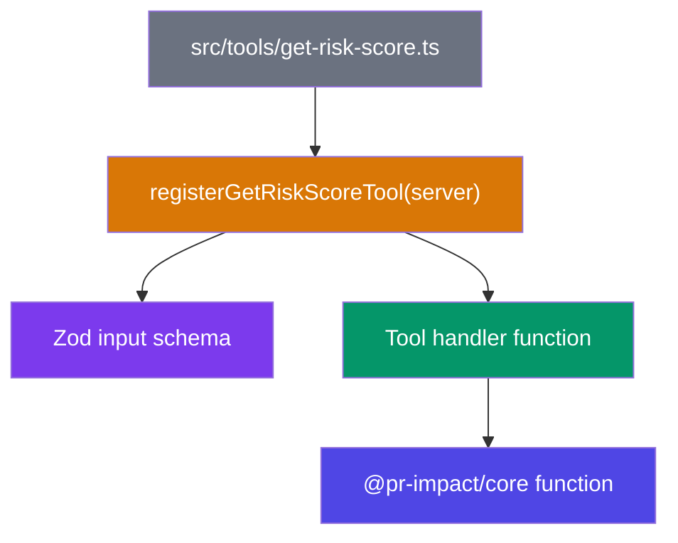
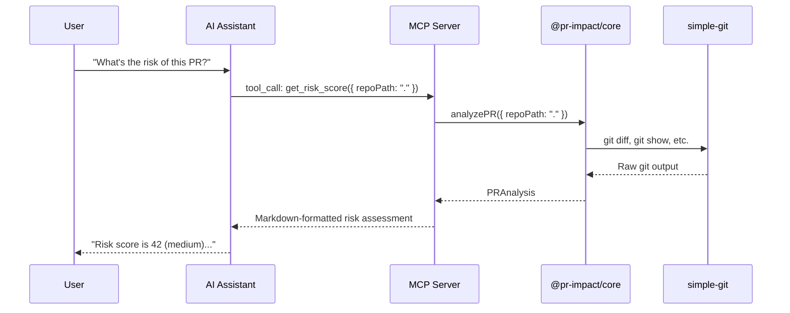

# MCP Server Integration

The `@pr-impact/mcp-server` package exposes pr-impact analysis capabilities as [Model Context Protocol](https://modelcontextprotocol.io/) tools. This allows AI assistants (Claude Code, Cursor, etc.) to call the analysis functions directly.

---

## Architecture



---

## Server Initialization

The MCP server follows the standard `@modelcontextprotocol/sdk` pattern:



---

## Available Tools

### `analyze_diff`

Full PR analysis combining all analysis steps.

| Parameter | Type | Required | Default |
|---|---|---|---|
| `repoPath` | string | No | `process.cwd()` |
| `baseBranch` | string | No | auto-detect `main`/`master` |
| `headBranch` | string | No | `HEAD` |

Returns: Markdown-formatted report covering breaking changes, test coverage, doc staleness, impact graph, and risk score.

### `get_breaking_changes`

Detect breaking API changes with severity filtering.

| Parameter | Type | Required | Default |
|---|---|---|---|
| `repoPath` | string | No | `process.cwd()` |
| `baseBranch` | string | No | auto-detect |
| `headBranch` | string | No | `HEAD` |
| `minSeverity` | `low` \| `medium` \| `high` | No | `low` |

Returns: Markdown-formatted list of breaking changes, filtered by severity.

### `get_risk_score`

Calculate the weighted risk score with factor breakdown.

| Parameter | Type | Required | Default |
|---|---|---|---|
| `repoPath` | string | No | `process.cwd()` |
| `baseBranch` | string | No | auto-detect |
| `headBranch` | string | No | `HEAD` |

Returns: Markdown-formatted risk assessment showing overall score, level, and factor breakdown.

### `get_impact_graph`

Build the import-dependency impact graph.

| Parameter | Type | Required | Default |
|---|---|---|---|
| `repoPath` | string | No | `process.cwd()` |
| `baseBranch` | string | No | auto-detect |
| `headBranch` | string | No | `HEAD` |
| `filePath` | string | No | all changed files |
| `depth` | number | No | `3` |

Returns: Markdown-formatted impact graph listing directly changed files, indirectly affected files, and dependency edges.

---

## Tool Registration Pattern

Each tool is defined in its own file under `src/tools/` and follows a consistent pattern:



1. Define a Zod schema for input validation.
2. Register the tool on the `McpServer` instance with name, description, and schema.
3. The handler calls the corresponding `@pr-impact/core` function and returns the result.

---

## Configuration

### Claude Code

Add to `.claude/mcp.json` or global settings:

```json
{
  "mcpServers": {
    "pr-impact": {
      "command": "npx",
      "args": ["-y", "@pr-impact/mcp-server"]
    }
  }
}
```

### Local development (monorepo)

```json
{
  "mcpServers": {
    "pr-impact": {
      "command": "node",
      "args": ["./packages/mcp-server/dist/index.js"]
    }
  }
}
```

### Claude Desktop

Add to `~/Library/Application Support/Claude/claude_desktop_config.json` (macOS) or `%APPDATA%\Claude\claude_desktop_config.json` (Windows):

```json
{
  "mcpServers": {
    "pr-impact": {
      "command": "npx",
      "args": ["-y", "@pr-impact/mcp-server"]
    }
  }
}
```

### Cursor

Add to `.cursor/mcp.json` in your project root:

```json
{
  "mcpServers": {
    "pr-impact": {
      "command": "npx",
      "args": ["-y", "@pr-impact/mcp-server"]
    }
  }
}
```

### VS Code (Copilot MCP)

Add to `.vscode/mcp.json` in your project root:

```json
{
  "servers": {
    "pr-impact": {
      "command": "npx",
      "args": ["-y", "@pr-impact/mcp-server"]
    }
  }
}
```

### Any MCP-compatible client

The server communicates over **stdio** (stdin/stdout) using JSON-RPC. Any MCP client that supports stdio transport can connect.

---

## Manual Testing

Use the [MCP Inspector](https://modelcontextprotocol.io/docs/tools/inspector) to test the server locally:

```bash
# Build the server first
pnpm build --filter=@pr-impact/mcp-server

# Run the inspector against the built server
npx @modelcontextprotocol/inspector node ./packages/mcp-server/dist/index.js
```

The inspector opens a web UI where you can:
1. See all registered tools and their input schemas
2. Call tools interactively with custom parameters
3. Inspect the JSON-RPC request/response payloads

---

## Communication Flow


