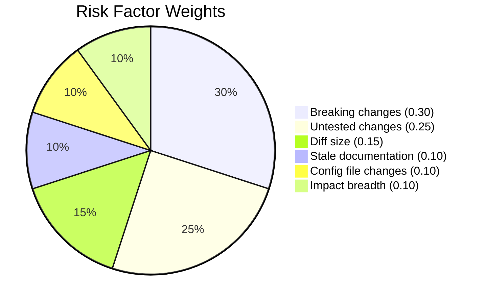
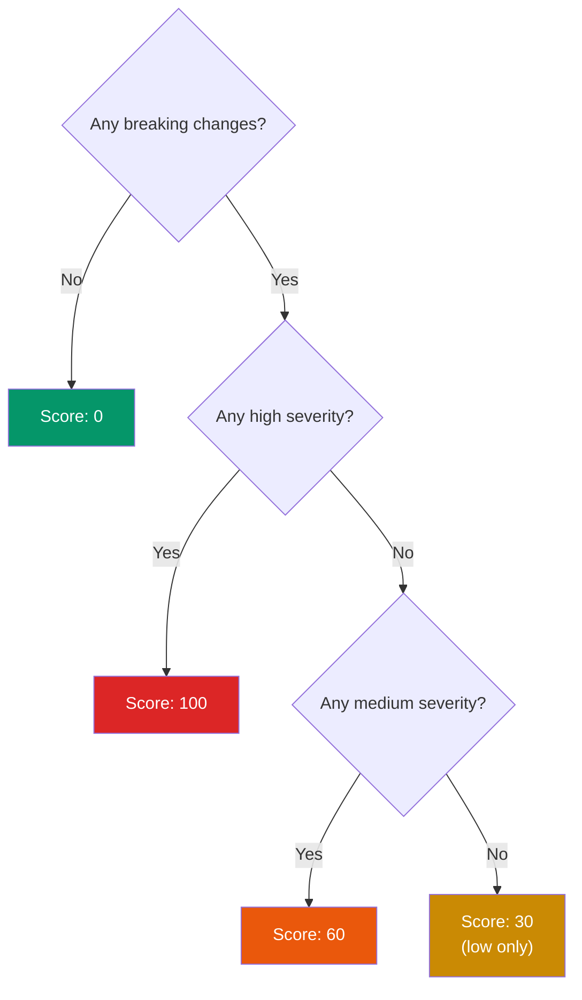
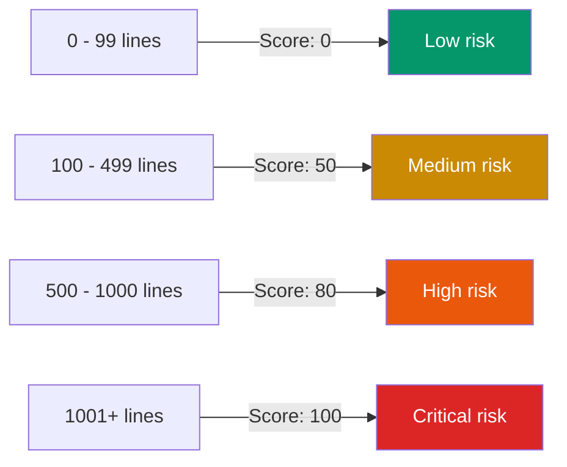
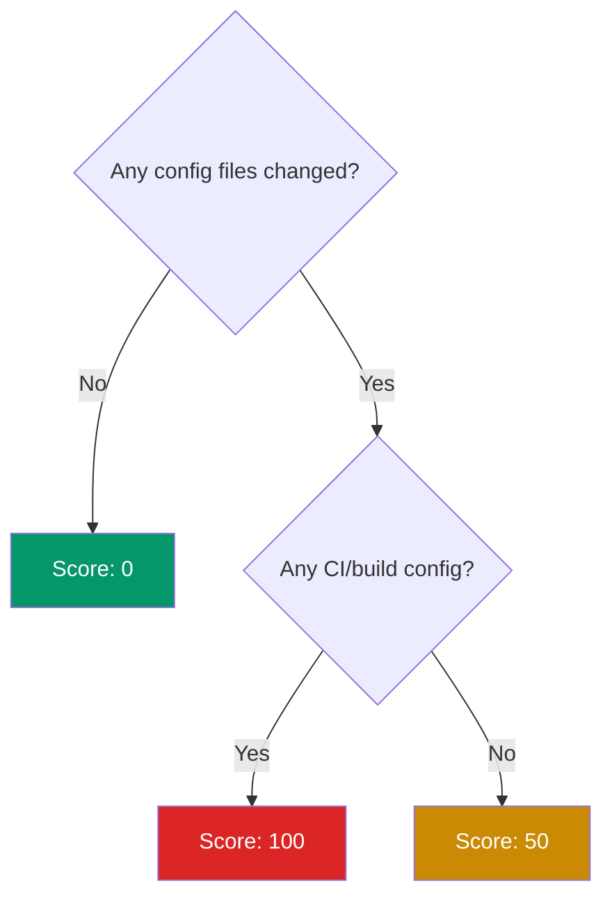
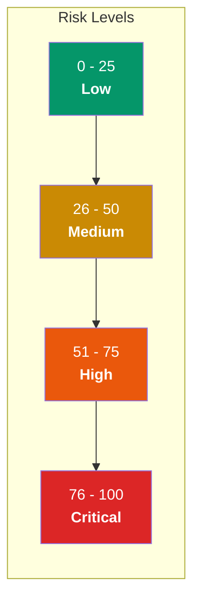

# Risk Scoring

The risk score is a weighted average of six independent factors, producing a single number from 0 to 100. The score maps to a severity level used for CI gates and human review prioritization.

---

## Formula

```
score = round( sum(factor_score * factor_weight) / sum(factor_weight) )
```

All weights sum to 1.0, so the formula simplifies to:

```
score = round( sum(factor_score * factor_weight) )
```

---

## Factor Weights



---

## Factor Scoring Logic

### 1. Breaking Changes (weight: 0.30)

Evaluates the severity of detected API breaking changes.



Breaking change types and their default severities:

| Type | Severity | Description |
|---|---|---|
| `removed_export` | **high** | An exported symbol was deleted |
| `changed_signature` | **medium** | Function/method signature changed |
| `changed_type` | **medium** | Symbol kind changed (e.g. function to class) |
| `renamed_export` | **low** | Symbol renamed but same signature |

### 2. Untested Changes (weight: 0.25)

Measures what fraction of changed source files lack corresponding test changes.

```
score = (1 - coverageRatio) * 100
```

Where `coverageRatio = sourceFilesWithTestChanges / changedSourceFiles`.

- If no source files changed, score is 0.
- If 3 of 4 source files have test changes, score is 25.
- If 0 of 4 source files have test changes, score is 100.

### 3. Diff Size (weight: 0.15)

Based on total lines changed (additions + deletions).



### 4. Stale Documentation (weight: 0.10)

Each stale reference adds 20 points, capped at 100.

```
score = min(staleReferences.length * 20, 100)
```

A stale reference is a doc file line that mentions a deleted path, renamed path, or removed export symbol.

### 5. Config File Changes (weight: 0.10)



CI/build config patterns that trigger score 100:

| Pattern | Examples |
|---|---|
| `.github/` | `.github/workflows/ci.yml` |
| `Dockerfile` | `Dockerfile`, `Dockerfile.prod` |
| `docker-compose` | `docker-compose.yml` |
| `webpack.config` | `webpack.config.js` |
| `vite.config` | `vite.config.ts` |
| `rollup.config` | `rollup.config.mjs` |
| `esbuild.config` | `esbuild.config.js` |
| `turbo.json` | `turbo.json` |
| `.gitlab-ci` | `.gitlab-ci.yml` |
| `Jenkinsfile` | `Jenkinsfile` |
| `.circleci/` | `.circleci/config.yml` |

### 6. Impact Breadth (weight: 0.10)

Each indirectly affected file adds 10 points, capped at 100.

```
score = min(indirectlyAffected.length * 10, 100)
```

Indirectly affected files are discovered via BFS over the reverse import dependency graph (default max depth: 3).

---

## Score-to-Level Mapping



---

## Example Calculation

Consider a PR with:
- 1 medium-severity breaking change
- 2 of 3 source files have test changes
- 250 total lines changed
- 1 stale doc reference
- No config changes
- 2 indirectly affected files

| Factor | Score | Weight | Weighted |
|---|---|---|---|
| Breaking changes | 60 | 0.30 | 18.0 |
| Untested changes | 33 | 0.25 | 8.3 |
| Diff size | 50 | 0.15 | 7.5 |
| Stale documentation | 20 | 0.10 | 2.0 |
| Config file changes | 0 | 0.10 | 0.0 |
| Impact breadth | 20 | 0.10 | 2.0 |
| **Total** | | **1.00** | **38 (medium)** |
